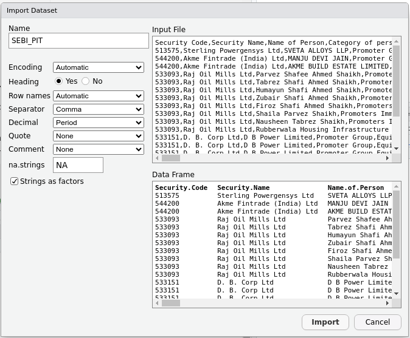

\newpage

# Abstract

  Insider trading is trading performed by people who have the potential to possess undisclosed price sensitive information about a security. These people include Promoters, Promoter Group, Close relatives to Promoters, Key Managerial Persons and Employees. When there is no undisclosed price sensitive information is available with these insiders, these people are legally permitted to transact on the securities.\
  It is safe to assume that these insiders would be having better assessment about the future prospects of the company. This case study focuses on insider trading data from BSE India website. This study was performed using R Programming in RStudio environment. Data for this study is publicly avaialbe on BSE India website. Data for Last 3 months was downloaded. This insider trading data was normalized for comparision using market cap which is again publicly available.\
  Analysis revealed that insider trading were witnessed mostly on smaller companies than in larger companies. Top acquisitions and Disposals were identified and visualized. \
  Data analysis skills like filtering, grouping, manipulating, pivoting, visualization have been demonstrated.

\newpage

# Introduction

Insiders are persons who can potentially gain undisclosed price sensitive information about a company. Trading by these persons on securities of that company is called insider trading. While insider trading when possessing undisclosed price sensitive information is prohibited, these persons are allowed to trade on such companies when no undisclosed price sensitive information is available with these insiders.\

This case study focuses on legally permitted insider trading as reported in BSE India web site. Even though no undisclosed price sensitive information is available with the insider who entered in to the transaction, insider trading data can give insights into the general perception of these insiders about the prosperity of that company. Hence study on this insider trading data can reveal useful insights.\


# Data Description

The primary dataset for this study comprises insider trading disclosures obtained from the Bombay Stock Exchange (BSE) India website <https://www.bseindia.com/corporates/Insider_Trading_new.aspx>, covering a recent period of three months. This publicly available data includes detailed records of transactions executed by company insiders, such as directors, key managerial personnel, and major shareholders. \

Each record in the dataset captures essential attributes, including the security code (unique identifier for each listed company), the type of transaction (acquisition or disposal of securities), transaction date, quantity traded, and transaction value. Market capitalization data for the corresponding companies were sourced separately from BSE to enable normalization and comparative analysis.\

By combining transaction values with market capitalization obtained from <https://www.bseindia.com/corporates/List_Scrips.html>, the dataset enables the calculation of normalized insider activity metrics, which form the basis for further analysis and visualization. 
\newpage

# Methodology

The methodology adopted in this study follows a structured approach to ensure comprehensive analysis and clear presentation of insider trading data. It begins with defining the research objectives, followed by systematic data preparation and cleaning. The cleaned data is then analyzed using quantitative techniques, and the results are communicated effectively through visualizations. Finally, the study draws actionable conclusions based on the insights gained. The key steps are outlined below:\

-   **Ask**\
    Define the research questions and objectives guiding the study.

-   **Prepare Data for Exploration**\
    Collect and organize insider trading and market capitalization data.

-   **Process Data from Dirty to Clean**\
    Clean the dataset by handling missing values, filtering relevant
    transactions, and structuring for analysis.

-   **Analyze Data**\
    Perform aggregation, normalization, and calculation of key metrics
    such as net transaction value relative to market cap.

-   **Share Data through Art of Visualizations**\
    Present findings using clear and insightful charts and tables to
    highlight patterns and trends.

-   **Act**\
    Interpret results and suggest actionable insights for stakeholders,
    including investors and regulators.

## Ask

- **What is Insider Trading?**\
    [As per Investopedia](https://www.investopedia.com/terms/i/insidertrading.asp): "Insider trading is the buying or selling of a company's securities by individuals who possess material, nonpublic information about that company" 
    Trading is legally permitted for insiders when they do not posses any undisclosed price sensitive information. Still these trades can reveal useful insights about the company since these people are most likely to have better understanding about future prospects of that company.\
    
- **Does all transactions are important to analyze?**\
    Experts give opinion that while acquisitions are positive signs, but disposals need not be negative. disposals might be done to raise funds by promoters for any purpose including entering into new business.
    Pledging and revoking is one such activity which is done by people to raise money without actual disposal. Hence pledging and revoking is excluded in this case study.\
    Transactions within promoter group should also be generally excluded since it has no value to analyze. However, these transactions get nullified during our processing since we ground data and form Net_Transaction which nullifies transactions within promoter group (Or within insiders).\

- **Does ESOP to be exluded?**\
    Employees other than Key Managerial Persons (KMP) is less likely to possess undisclosed price sensitive information. However, they will be having general perception about company's health. Employees are expected to redeem alloted ESOPs. Hence allotment and disposal will nullify each other. If employees hold on to the allotment, it gives a positive signal about a company. However, one issue with ESOPs are its timing. If the time horizon of this study is more than a year or two, ESOP holding (or disposal) would not skew the analysis. Since this study focuses on last 3 months data only, ESOPs alloted before 3 months could give false negative (Or ESOP allotted very late can give false positive). \
    \
    For Top acquisitions / disposals, special check to be done for whether it is due to ESOP.
    
### Hypothesis: 
    Insider Trading happens mostly with Smaller companies in terms of Market Capitalization
### Research Problem:
-    **To identify companies where significant insider trading happened**\
    Company wise Top acquisitions and Top disposals are to be identified
-    **To explore top acquisitions / disposals for ESOPs**\
    
  
## Prepare data for exploration
-  **Get Makrket Capitalisation data by fetching directly from BSE India website.**
-  **Download Insider Trading data of last 3 months from BSE India website and import it as dataframe**
  
### Load required libraries

If you get error while loading library, install them first (uncomment)

```{r}
#install.packages("tidyverse")
#install.packages("tidyr")
#install.packages("tidyselect")
#install.packages("rvest")
#install.packages("httr")
#install.packages("gridExtra")
library(tidyverse)
library(tidyr)
library(tidyselect)
library(rvest)
library(httr)
library(scales)
library(gridExtra)
```


### Getting Market Cap data

Market cap can be obtained from <https://www.bseindia.com/corporates/List_Scrips.html>. Data can be obtained separately for securities under AT0 and T1. They need to be merged before processing any other data. 

```{r}
base_url <- "https://www.bseindia.com/corporates/List_Scrips.html"
url_T0 <- "https://api.bseindia.com/BseIndiaAPI/api/ListofScripData/w?Group=&Scripcode=&industry=&segment=EQT0&status=Active"

# GET Request with Custom Headers and Token-Based Authentication
hdrs <- add_headers(
  `User-Agent` = 'Mozilla/5.0 (X11; Linux x86_64; rv:138.0) Gecko/20100101 Firefox/138.0',
  `Accept` = 'application/json, text/plain, */*',
  `Accept-Language` = 'en-US,en;q=0.5',
  #`Accept-Encoding` = 'gzip, deflate, br, zstd',
  `Origin` = 'https://www.bseindia.com',
  `Referer` = 'https://www.bseindia.com/',
  `Sec-Fetch-Dest` = 'empty',
  `Sec-Fetch-Mode` = 'cors',
  `Sec-Fetch-Site` = 'same-site',
  `Priority` = 'u=0'
)

# Perform the GET request
response <- GET(base_url,hdrs)
response <- GET(url_T0, hdrs)
text <- content(response, as = "text", encoding = "UTF-8")
listings_T0 <- jsonlite::fromJSON(text)

url_T1 <- "https://api.bseindia.com/BseIndiaAPI/api/ListofScripData/w?Group=&Scripcode=&industry=&segment=Equity&status=Active"

response <- GET(url_T1, hdrs)
text <- content(response, as = "text", encoding = "UTF-8")
listings_T1 <- jsonlite::fromJSON(text)
```

### Downloading Insider Trading data from BSE India website and import into RStudio

-   Go to <https://www.bseindia.com/corporates/Insider_Trading_new.aspx> (Ctrl + Click when in editing mode, direct click when in html page). Here you can download insider trading data\
-   Select From and To date such that last 3 months data is loaded and click 'Submit' button. (Leave Security Name blank). Rename the file to 'SEBI_PIT.csv'\
-   Click Download All button and download the csv file to this project folder\
-   \
-   This image is for reference only. Below code chunk will do the import and preparing stuff.\

```{r}
SEBI_PIT <- read.csv("SEBI_PIT.csv", quote="", stringsAsFactors=TRUE)
```


## Process data from dirty to clean

### Process listings for market cap data
- Merge both listings T0 and T1
- Convert data type of MarketCap as double
- Convert data type of Scrip_cd as integer
- Select columns only columns required for this study

```{r}
listings <- rbind(listings_T0,listings_T1)
if(exists("listings_T0")) rm(listings_T0)
if(exists("listings_T1")) rm(listings_T1)
if(exists("response")) rm(response)
if(exists("url_T0")) rm(url_T0)
if(exists("url_T1")) rm(url_T1)
if(exists("text")) rm(text)
if(exists("hdrs")) rm(hdrs)
listings$Mktcap <- as.double(listings$Mktcap)
listings$SCRIP_CD <- as.integer(listings$SCRIP_CD)
listings <- listings %>% 
  select(SCRIP_CD,Scrip_Name,INDUSTRY,Mktcap) %>% 
  arrange(Scrip_Name)
```

### Process Insider Trading data and map market cap data from listings

-   Remove un-necessary columns
-   Rename columns to meaningful short names
-   Filter data on transaction type (Interested only in Aquisition and
    disposal)
-   Convert date of transaction from text to date

```{r}
# Keep only necessary columns
SEBI_PIT <- SEBI_PIT[c(
  "Security.Code",                                                          
  "Security.Name",                                                             
  "Category.of.person",
  "Number.of.Securities.Acquired.Disposed.Pledge.etc.",
  "Value..of.Securities.Acquired.Disposed.Pledge.etc",                       
  "Transaction.Type...Buy.Sale.Pledge.Revoke.Invoke.",                        
  "Date.of.acquisition.of.shares.sale.of.shares.Date.of.Allotment.From.date.",
  "Mode.of.Acquisition"
                               
)]

# Rename columns to meaning short names
SEBI_PIT <- SEBI_PIT %>% 
  rename(
    Code=Security.Code,
    Name=Security.Name,
    Category_of_Person=Category.of.person,
    Number_of_Securities=Number.of.Securities.Acquired.Disposed.Pledge.etc.,
    Value_of_Securities=Value..of.Securities.Acquired.Disposed.Pledge.etc,
    Transaction_Type=Transaction.Type...Buy.Sale.Pledge.Revoke.Invoke.,
    Date_of_Transaction=Date.of.acquisition.of.shares.sale.of.shares.Date.of.Allotment.From.date.,
    Mode_of_Transaction=Mode.of.Acquisition

         )
# Filter only Aquisition or Displosal. Not interested in Pledge oor revoke of pledge
SEBI_PIT <- SEBI_PIT %>% 
  filter(Transaction_Type %in% c("Acquisition","Disposal"))

#Convert column type of Date of transaction from text to Date
SEBI_PIT$Date_of_Transaction <- as.Date(SEBI_PIT$Date_of_Transaction,format="%d %B %Y")

spg <- SEBI_PIT %>% 
  select( -Number_of_Securities, -Mode_of_Transaction, -Date_of_Transaction) %>% 
  pivot_wider(names_from = Transaction_Type,
              values_from = Value_of_Securities,
              values_fn = sum,
              values_fill = 0) %>% 
  mutate(Net_Transaction_Value = Acquisition - Disposal)
spg <- merge(spg,listings,by.x = "Code", by.y = "SCRIP_CD") %>% 
  #select(-Scrip_Name, -INDUSTRY) %>% 
  select(Code,Category_of_Person, Name,Net_Transaction_Value,Mktcap) %>% 
  mutate(Category_of_Person = if_else(grepl("Promoter",Category_of_Person),"Promoter Group",Category_of_Person)) %>% 
  group_by(Code, Category_of_Person, Name, Mktcap) %>% 
  summarise(Net_Transaction_Value = sum(round(Net_Transaction_Value/10000000,3))) %>% 
  ungroup() %>% 
  mutate(Net_Txn_Val_on_Mktcap = round(Net_Transaction_Value/Mktcap,3)) %>% 
  arrange(Net_Txn_Val_on_Mktcap) %>% 
  left_join(listings %>% select(SCRIP_CD,INDUSTRY), c("Code" = "SCRIP_CD")) %>% 
  
  select(Code,Name,Category_of_Person,INDUSTRY,Mktcap,Net_Transaction_Value,Net_Txn_Val_on_Mktcap) 
spg <- spg[
  !is.na(spg$Net_Txn_Val_on_Mktcap) &
  !is.infinite(spg$Net_Txn_Val_on_Mktcap) &
  !is.nan(spg$Net_Txn_Val_on_Mktcap),
]
```


## Analyze data and Share data through Art of Visualizations

### Plotting Net Acquisition/Disposal on market cap against market cap
- Net Acquisition/Disposal is plotted against market cap for different ranges
- Companies with significant insider trading compared to its market cap is listed on the chart

```{r}
spg_clean <- spg
plt1 <- ggplot(spg_clean, aes(x= Mktcap,y=Net_Txn_Val_on_Mktcap,colour = Net_Txn_Val_on_Mktcap)) +geom_bar(stat = "identity")+ylim(-0.6,0.6)+xlim(0,200000) + theme_bw()+   theme(legend.position = "none",plot.title = element_text(hjust = 0.5, size = 14, face ="bold"))+ylab("")
plt2 <- ggplot(spg_clean, aes(x= Mktcap,y=Net_Txn_Val_on_Mktcap,colour = Net_Txn_Val_on_Mktcap)) +geom_bar(stat = "identity")+ylim(-0.6,0.6)+xlim(0,200)+ theme_bw() +   theme(legend.position = "none",plot.title = element_text(hjust = 0.5, size = 14, face ="bold"))+ geom_text(aes(x = Mktcap, y = Net_Txn_Val_on_Mktcap, label = ifelse(abs(Net_Txn_Val_on_Mktcap) > 0.30 | Net_Txn_Val_on_Mktcap < -0.30, as.character(Name), "")),hjust=0, size = 3)+ylab("")
plt3 <- ggplot(spg_clean, aes(x= Mktcap,y=Net_Txn_Val_on_Mktcap,colour = Net_Txn_Val_on_Mktcap)) +geom_bar(stat = "identity")+ylim(-0.6,0.6)+xlim(200,500) + theme_bw()+   theme(legend.position = "none",plot.title = element_text(hjust = 0.5, size = 14, face ="bold"))+ geom_text(aes(x = Mktcap, y = Net_Txn_Val_on_Mktcap, label = ifelse(abs(Net_Txn_Val_on_Mktcap) > 0.25 | Net_Txn_Val_on_Mktcap < -0.25, as.character(Name), "")),hjust=0, size = 3)+ylab("")
plt4 <- ggplot(spg_clean, aes(x= Mktcap,y=Net_Txn_Val_on_Mktcap,colour = Net_Txn_Val_on_Mktcap)) +geom_bar(stat = "identity")+ylim(-0.6,0.6)+xlim(500,1000)+ theme_bw() +   theme(legend.position = "none",plot.title = element_text(hjust = 0.5, size = 14, face ="bold"))+ geom_text(aes(x = Mktcap, y = Net_Txn_Val_on_Mktcap, label = ifelse(abs(Net_Txn_Val_on_Mktcap) > 0.1 | Net_Txn_Val_on_Mktcap < -0.1, as.character(Name), "")),hjust=0, size = 3)
plt5 <- ggplot(spg_clean, aes(x= Mktcap,y=Net_Txn_Val_on_Mktcap,colour = Net_Txn_Val_on_Mktcap)) +geom_bar(stat = "identity")+ylim(-0.6,0.6)+xlim(1000,2000)+ theme_bw() +   theme(legend.position = "none",plot.title = element_text(hjust = 0.5, size = 14, face ="bold"))+ geom_text(aes(x = Mktcap, y = Net_Txn_Val_on_Mktcap, label = ifelse(abs(Net_Txn_Val_on_Mktcap) > 0.1 | Net_Txn_Val_on_Mktcap < -0.1, as.character(Name), "")),hjust=0, size = 3)+ylab("")
plt6 <- ggplot(spg_clean, aes(x= Mktcap,y=Net_Txn_Val_on_Mktcap,colour = Net_Txn_Val_on_Mktcap)) +geom_bar(stat = "identity")+ylim(-0.6,0.6)+xlim(2000,20000)+ theme_bw() +   theme(legend.position = "none",plot.title = element_text(hjust = 0.5, size = 14, face ="bold"))+ geom_text(aes(x = Mktcap, y = Net_Txn_Val_on_Mktcap, label = ifelse(abs(Net_Txn_Val_on_Mktcap) > 0.1 | Net_Txn_Val_on_Mktcap < -0.1, as.character(Name), "")),hjust=0, size = 3)+ylab("")
#supressWarnings(print(plt1))
#supressWarnings(print(plt2))
#supressWarnings(print(plt3))
#supressWarnings(print(plt4))
#supressWarnings(print(plt5))
#supressWarnings(print(plt6))
gridExtra::grid.arrange(plt1,plt2,plt3,plt4,plt5,plt6,ncol=3,top="Net Acquisition/Disposal Vs Market cap")

```

### Identifying Top acquisitions and disposals normalized on market cap

```{r}
spg_aq <- spg %>% 
  filter(Net_Txn_Val_on_Mktcap > 0.01 & Mktcap > 500) %>% 
  mutate(Net_Transaction_Value=Net_Transaction_Value/10000000) %>% 
  arrange(desc(Net_Txn_Val_on_Mktcap)) %>% 
  slice_head(n=10) %>% 
  select(Name,Mktcap,Net_Transaction_Value,Net_Txn_Val_on_Mktcap) %>% 
  arrange(Net_Txn_Val_on_Mktcap) %>% 
  mutate(rownum = row_number())
spg_di <- spg %>% 
  filter(Net_Txn_Val_on_Mktcap < -0.01 & Mktcap > 500) %>% 
  mutate(Net_Transaction_Value=Net_Transaction_Value/10000000) %>% 
  arrange(Net_Txn_Val_on_Mktcap) %>% 
  slice_head(n=10) %>% 
  select(Name,Mktcap,Net_Transaction_Value,Net_Txn_Val_on_Mktcap)  %>% 
  arrange(desc(Net_Txn_Val_on_Mktcap)) %>% 
  mutate(rownum = row_number())
spg_ad <- rbind(spg_aq,spg_di)

ggplot(spg_ad,aes(x= rownum, y=Net_Txn_Val_on_Mktcap,fill = Net_Txn_Val_on_Mktcap > 0))+geom_bar(stat = "identity",width = 0.7)+coord_flip()+xlab("")+ theme(
    axis.text.y = element_blank(),   # hide Y-axis labels
    axis.ticks.y = element_blank(),  # hide Y-axis ticks
    legend.position = "none",
    plot.title = element_text(size = 20, face = "bold", hjust = 0.5)
  )+geom_text(aes(y = Net_Txn_Val_on_Mktcap, x=rownum, label = Name,hjust = if_else(Net_Txn_Val_on_Mktcap < 0 , 1, 0)))+ xlim (0,12)+ ylim(-0.80,0.80) + annotate("text", x= 10.5, y = 0.05, label = "Acquisitions", hjust=0, vjust=-1, color="darkgreen", fontface="bold", size=8) + annotate("text", x= 10.5, y = -0.05, label = "Disposals", hjust=1, vjust=-1, color="red", fontface="bold", size=8)+labs(title = "Top acquisitions and Disposals w.r.t Market cap")
```


### More insights into Top acquisitions and disposals

```{r}
aq <- spg_aq %>% 
  arrange(desc(Net_Txn_Val_on_Mktcap)) %>% 
  mutate(Net_Transaction_Value=10000000 * Net_Transaction_Value) %>% 
  select(-rownum) %>% 
  slice_head(n=3)
aq1 <- as.character(aq$Name[1])
aq2 <- as.character(aq$Name[2])
aq3 <- as.character(aq$Name[3])
di <- spg_di %>% 
  arrange((Net_Txn_Val_on_Mktcap)) %>% 
  mutate(Net_Transaction_Value=10000000 * Net_Transaction_Value) %>% 
  select(-rownum) %>% 
  slice_head(n=3)
di1 <- as.character(di$Name[1])
di2 <- as.character(di$Name[2])
di3 <- as.character(di$Name[3])

cat_aq1 <- spg %>% filter(Name %in% aq1)
cat_aq2 <- spg %>% filter(Name %in% aq2)
cat_aq3 <- spg %>% filter(Name %in% aq3)

cat_di1 <- spg %>% filter(Name %in% di1)
cat_di2 <- spg %>% filter(Name %in% di2)
cat_di3 <- spg %>% filter(Name %in% di3)

pa1 <- ggplot(cat_aq1,aes(y="",x=Net_Transaction_Value,fill = Category_of_Person))+geom_bar(stat = "identity",width = 1, color = "white", size = 1.2)+ylab("")+xlab("")
pa2 <- ggplot(cat_aq2,aes(y="",x=Net_Transaction_Value,fill = Category_of_Person))+geom_bar(stat = "identity",width = 1, color = "white", size = 1.2)+ylab("")+xlab("")
pa3 <- ggplot(cat_aq3,aes(y="",x=Net_Transaction_Value,fill = Category_of_Person))+geom_bar(stat = "identity",width = 1, color = "white", size = 1.2)+ylab("")+xlab("")
pd1 <- ggplot(cat_di1,aes(y="",x=Net_Transaction_Value,fill = Category_of_Person))+geom_bar(stat = "identity",width = 1, color = "white", size = 1.2)+ylab("")+xlab("")
pd2 <- ggplot(cat_di2,aes(y="",x=Net_Transaction_Value,fill = Category_of_Person))+geom_bar(stat = "identity",width = 1, color = "white", size = 1.2)+ylab("")+xlab("")
pd3 <- ggplot(cat_di3,aes(y="",x=Net_Transaction_Value,fill = Category_of_Person))+geom_bar(stat = "identity",width = 1, color = "white", size = 1.2)+ylab("")

gridExtra::grid.arrange(pa1,pa2,pa3,pd1,pd2,pd3,ncol=1,top="Category of Person for Top 3 Acquisition / Disposal")
aq
di
```

## Act
- Top acquisitions will be used for further fundamental analysis and will be considered for next investment opportunity\
- Top disposals will be used to check if current portfolio holds any of these securities. If held, further deep fundamental analysis will be carried out to decide on holding the security or to sell it\

# Case-Study Summary
- Purpose of this case study is to analyze insider trading data from BSE India website using RStudio\
- Rstudio was chosen because this case study is part of Google Data Analytics course on Coursera\
- Different data preparation options were demonstrated like direct fetching from website and importing csv file\
- Data cleaning and processing skills were demonstrated\
- Direct report preparation using Knit on RStudio with Rmarkdown was used to prepare report in pdf format\
- Different data handling skills like select, mutate, filter, pivot, group_by, sorting were demosntrated.\
- Data were plotted to reveal hidden insights\


